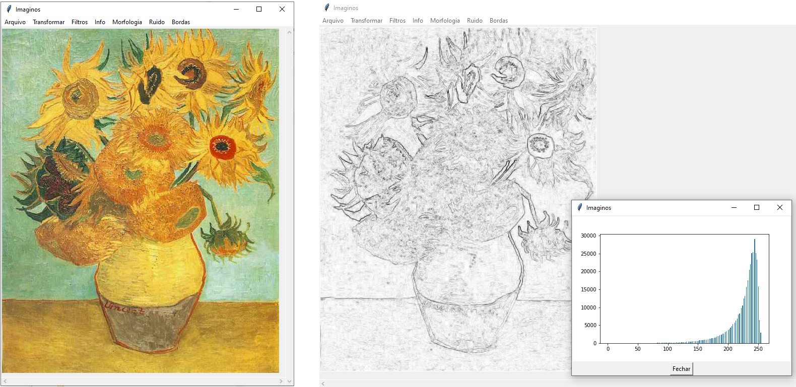

# My portfolio
## A selection of Python code produced over the years
#### Versão em português: [README_PT](/README_PT.md)

##  [Similis](/Similis)
A GUI application with a collection of image processing options, used as an educational tool for my lectures on the grad course Digital Image Processing.

##  [Monte Carlo Conductivity Simulator](/Monte%20Carlo%20Conductivity%20Simulator)
The results of both my Masters dissertation and Doctorate thesis (discreet and continuous simulation, respectivelly). 
The simulators allows the estimation of the minimum required ammount of conductive additives necessary in a polymer to make it electrically conductive. 
This is very relevant, since additives have a high cost and reduce mechanical properties of the polymer, and this minimum ammount, called the percolation threshold, varies greatly based on the geometry of the additives. 
**Dissertation link:** [Método de previsão de limiar de percolação e condutividade elétrica em compósitos poliméricos por simulação de Monte Carlo](https://repositorio.ufsc.br/bitstream/handle/123456789/99274/304697.pdf?sequence=1&isAllowed=y) 
**Thesis link:** [Modelos de condutividade em compósitos condutores por simulação de Monte Carlo no espaço contínuo](https://repositorio.ufsc.br/xmlui/bitstream/handle/123456789/167688/340638.pdf?sequence=1&isAllowed=y) 

 
 

##  [Porous Media Analyzer](/Porous%20Media%20Analyzer)
A framework for 3D volume images processing and simulation (Digital Properties Laboratory). 
Includes an extensible GUI for implementation of new procedures, and already includes some prototype algorithms, such as [Navier-Stokes Linear Approximation](https://journals.aps.org/pre/abstract/10.1103/PhysRevE.97.023303) and [Cation Exchange Formation Factor](http://limacloud.duckdns.org:89/CILAMCE/6062.pdf). 

 

## [Other Scripts](/Other%20Scripts)
Collection of short scripts to solve punctual problems. 
- [**Machine Learning Permeability**](/Other%20Scripts/ml_permeability.py) - This model uses ML models to predict a porous rock permeablity, using the geometric characterization of its pores as features.
- [**Colored Sphere**](/Other%20Scripts/color_spheres.py) - An exploration of a lesser viral color illusion (no, not the dress one).
- [**Covid-19 Inspector**](/Other%20Scripts/covid19_inspector) - A small script that takes the latest covid active cases from the John Hopkins dataset and fits them to a exponential decay model, helping to identify if the contagion peak has passed.
- [**Digital Rock Portal Tiff Downloader**](/Other%20Scripts/drp_downloader.py) - A tool intended to download porous rock images from non-stacked tiff format from the [Digital Rock Portal](https://www.digitalrocksportal.org).
- [**Interferometer Readings**](/Other%20Scripts/interferometer_reading.py) - Treats surface rugosity data aquired by light interferometry to predict interface compatibility for sinter bonding.
- [**Spherical Coordinations Generator**](/Other%20Scripts/sphere_coordinates_distribution.py) - Representation and solution for a common mistake in random spherical coordinates generation.

