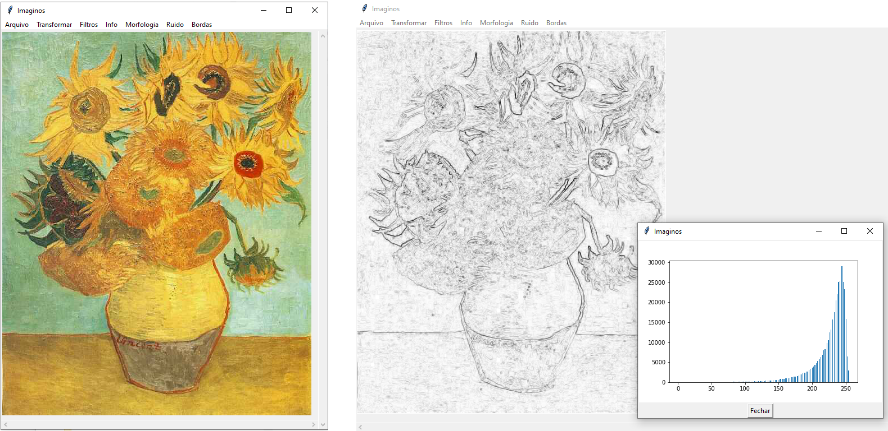

# Meu portfólio
## Uma seleção de códigos em Python produzidos ao longo dos anos

##  [Similis](/Similis)
Uma aplicação com GUI contendo uma coleção de opções de processamento de imagens, usado como ferramenta pedagógica nas aulas de pós graduação de Processamento de Imagens Digitais.

##  [Simulador de Condutividade Monte Carlo](/Monte%20Carlo%20Conductivity%20Simulator)
Resultados da minha dissertação de mestrado e tese de doutorado (simulação discreta e contínua, respectivamente) 
Esses simuladores permitem estimar a quantidade mínima de aditivos condutores necessária para tornar um polímero um condutor elétrico 
Essa informação é relevante pois aditivos tem um custo elevado e reduzem as propriedades mecânicas do polímero, e essa quantidade mínima, chamada de limiar de percolação, varia muito dependendo da geometria do aditivo. 
**Link da dissertação:** [Método de previsão de limiar de percolação e condutividade elétrica em compósitos poliméricos por simulação de Monte Carlo](https://repositorio.ufsc.br/bitstream/handle/123456789/99274/304697.pdf?sequence=1&isAllowed=y) 
**Link da tese:** [Modelos de condutividade em compósitos condutores por simulação de Monte Carlo no espaço contínuo](https://repositorio.ufsc.br/xmlui/bitstream/handle/123456789/167688/340638.pdf?sequence=1&isAllowed=y) 

 
 

##  [Processador de meio poroso](/Porous%20Media%20Analyzer)
Um framework para funções de simulação e processamento de imagens 3D voxelizadas (Laboratório Digital de Propriedades). 
Inclui uma GUI extensiva para implementar novos procedimentos, e já inclui alguns como [Aproximação Linear de Navier-Stokes](https://journals.aps.org/pre/abstract/10.1103/PhysRevE.97.023303) e [Fator de Formação com Troca de Cátions](http://limacloud.duckdns.org:89/CILAMCE/6062.pdf). 

 

## [Outros Scripts](/Other%20Scripts)
Coleção de scripts curtos para resolver problemas pontuais. 
- [**Permeabilidade por Aprendizado de Máquina**](/Other%20Scripts/ml_permeability.py) - Esse modelo utiliza AM para prever a permeabilidade de rochas porosas utilizando a caracterização geométrica dos seus poros como características.
- [**Esferas Coloridas**](/Other%20Scripts/color_spheres.py) - Uma exploração de uma imagem de ilusão de ótica que viralizou em 2019 (não, não o vestido).
- [**Inspetor Covid-19**](/Other%20Scripts/covid19_inspector) - Um script curto que obtém os dados de casos ativos de covid do dataset da universidade John Hopkins e os ajusta a um modelo de decaimento exponencial, ajudando a identificar se o pico de contágio passou.
- [**Digital Rock Portal Tiff Downloader**](/Other%20Scripts/drp_downloader.py) - Uma ferramenta desenhada para baixar imagens de rochas prosas em formato .tiff do [Digital Rock Portal](https://www.digitalrocksportal.org).
- [**Leitor de Interferometria**](/Other%20Scripts/interferometer_reading.py) - Trata dados de rugosidade superficial adquiridos por iterferometria de luz para prever compatibilidade de interface em sinterização por difusão.
- [**Gerador de Coordenadas Esféricas**](/Other%20Scripts/sphere_coordinates_distribution.py) - Representação e solução para um erro comum na geração de coordenadas esféricas aleatórias.

